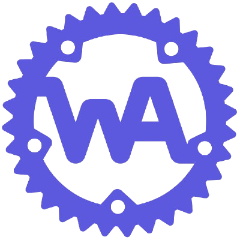

# web chat

Version: 6.0.0_b

This is still been developed, so it has some bugs. I would appreciate if you want to contribute with the project

## Develop by your own

### My recomendations - Docker

If you want to develop your own version of this chat, you should get docker installed, so you don't have to worry about configure anything or make shure that this will work on your machine, is everythig already configured for you. Besides, in a virtualized environment, errors like "it works on my machine" can be avoidable. I made this to be really simple to just "enter and use" with no need for configuration. <!--fuck the history that was deleted because of him, how could he do that with me?-->

 
<a href="https://commons.wikimedia.org/wiki/File:Docker_logo.png">Docker, Inc.</a>, <a href="http://www.apache.org/licenses/LICENSE-2.0">Apache License 2.0</a>, via Wikimedia Commons

### Start the server

To start the server, use: `run`, this command will make shure that everything necessary to make this project work is being executed and is working correctly.

## Algumas ideias para usar na página

para transição de paginas ➜ view Transitions API

scroll ➜ animation-timeline

## Versions

<!--------------------
Front-end
---------------------->

### 0.0.1 - First version

this version included:

- [X] HTML
- [X] CSS
- [X] JS <!--js just appeard in future versions beetween 0.0.1 and 1.0.0, but was included in the version 0-->

<!--------------------
Obj Oriented Front-end
---------------------->

### 1.0.0 - Front-end with Object Orientation

*Front-end entirely rewritten*

New features with this version of front-end includes:

- [X] Object orientation

<!--------------------
Back-end
---------------------->

### 2.0.0 - Back-end

This version of the back-end includes:

- [X] NodeJS
- [X] Express framework
- [X] JavaScript

<!--------------------
Back-end in Deno
---------------------->

### 3.0.0 - Back-end in Deno

this version includes:

- [X] Deno
- [X] Oak framework
- [X] TypeScript

<!--------------------
Front-end in WASM
---------------------->

### 4.0.0 - WASM features in the front-end

New features with wasm-pack include:

- [X] Rust
- [X] UUID generator
- [ ] Connection with the back-end

<!--------------------
Back-end in Golang
---------------------->

### 5.0.0 - back-end in Golang

New features with this version of back-end includes:

- [X] No frameworks
- [X] Golang

<!--------------------
Front-end in TS
---------------------->

### 6.0.0 - Front-end in TS

New features with this version of front-end includes:

- [X] TypeScript
- [ ] TailwindCSS